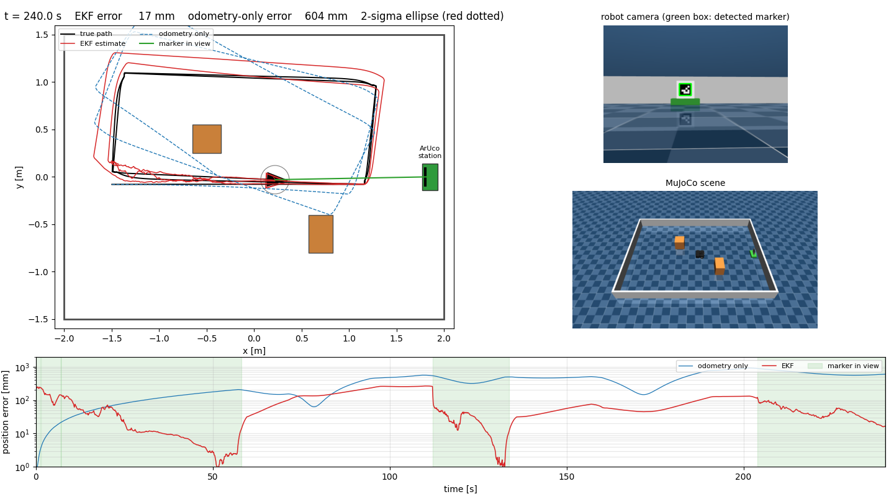

# 41014/42043 Integrated Project - Track A: Visual Waypoint Navigation

A TurtleBot3 with a 2D LiDAR and a camera in MuJoCo navigates a room with obstacles and docks to an ArUco-marked charging station. The estimator and controller use the estimated state only; simulator ground truth is used for evaluation and drawing only.



*A logged run on the simulated robot. Black: true path. Red: EKF estimate (dotted ellipse: its 2-sigma position uncertainty). Blue dashed: odometry only. Green shading in the error plot: the marker is in view.*

## Status

| Part | State |
|---|---|
| State-space model, observability and controllability analysis | Done, checked numerically ([docs/findings.md](docs/findings.md), stage 1) |
| Driver layer (wheel-speed loop on the simulated motors, encoders) | Done and validated in MuJoCo |
| Scene (room, obstacles, ArUco station), camera, marker pose from corners | Done and validated in MuJoCo |
| EKF with fixed odometry gains (A) and gains estimated online (B) | Done; validated on synthetic and MuJoCo data. The filters are still overconfident on MuJoCo data (see findings) |
| LiDAR, obstacle avoidance, LQR tracker, docking | Not started |
| Hardware | Not started (the lab was not open to external use this week) |
| `main.py` (single-command demonstration) | Placeholder, not implemented |

## Repository layout

```
perception/   ArUco detection and marker pose from the detected corners
estimation/   motion and measurement models, EKF (fixed or estimated odometry gains)
control/      (empty: the controller is not written yet)
drivers/      wheel-speed loop and the MuJoCo TurtleBot3 driver (the interface a hardware driver would replace)
sim/          scene generation, data collection and calibration on MuJoCo, a synthetic plant
experiments/  replay and evaluation, comparisons, noise-model study, visualisation, interactive viewer
notebooks/    Colab notebooks 00 to 05: setup, drive characterisation, model analysis, scene, camera, EKF on MuJoCo
tests/        plain-assert tests; `python tests/run_all.py` runs all of them
results/      text outputs of the experiments (synthetic/ and mujoco_3.3.7/)
docs/         findings.md (measured results and their limits), dev_environment.md, images/
```

## Install and run

Python 3.9 or newer:

```bash
pip install -r requirements.txt
```

On Windows with Python 3.9 pip may try to build `mujoco` from source; use `pip install --only-binary=:all: mujoco`. A known DLL problem and the Windows set-up are described in [docs/dev_environment.md](docs/dev_environment.md).

Fetch the TurtleBot3 model (not stored in this repository, Apache-2.0):

```bash
git clone --depth 1 --filter=blob:none --sparse https://github.com/ROBOTIS-GIT/robotis_mujoco_menagerie.git
git -C robotis_mujoco_menagerie sparse-checkout set robotis_tb3
```

Run the tests:

```bash
python tests/run_all.py
```

Run the experiments (the MuJoCo ones need `--model-dir robotis_mujoco_menagerie/robotis_tb3`):

```bash
python experiments/ekf_synthetic.py 10
python experiments/mujoco_ekf.py --model-dir robotis_mujoco_menagerie/robotis_tb3 --duration 240 --subpixel --run-file run.npz
python experiments/visualize_run.py --model-dir robotis_mujoco_menagerie/robotis_tb3 --run-file run.npz --out-dir viz --subpixel
python experiments/view_scene.py --model-dir robotis_mujoco_menagerie/robotis_tb3
```

The last two write a video and an overview image, and open an interactive 3D viewer. The scene generator writes its files next to the robot model, and the marker texture type is picked by a test render because MuJoCo versions differ.

## Findings so far

All numbers are in [docs/findings.md](docs/findings.md) with the conditions and limits; the main points:

- The simulated robot's odometry depends on speed and yaw rate (linear ratio about 0.93 at low speed and 0.87 above, yaw ratio 0.73 to 0.84), and this depends on the MuJoCo version (3.3.7 against 3.15.0), so calibrated values are not portable.
- On the MuJoCo run the position error is a few millimetres to centimetres while the marker is in view and grows to about half a metre within a minute of odometry alone.
- Estimating the gains online (B) is close to a fixed-gain filter whose gains were measured on arcs, and clearly better than a single-point calibration. With noise-free calibration a fixed-gain filter is better; the advantage of B depends on how good the calibration is.
- Every variant tested is overconfident on MuJoCo data (ANEES 17 or more against an ideal 3). The marker pose error has a systematic part and is correlated between frames, which the filter does not model.

## Demo video

Not yet made. A 40 s visualisation of a logged run is generated by `experiments/visualize_run.py`.

## Contribution statement

Individual project (42043), single author: Hongjie Zheng.

## Generative AI declaration

Claude (Anthropic), through Claude Code, was used throughout this project as a coding assistant. It wrote most of the code and tests in this repository, ran the experiments that can run locally, helped diagnose failures, and drafted the findings log. The author directed the work and made the choices between options, ran the Colab notebooks and reported their outputs, reviewed the results and is responsible for the submission. Commits made with Claude carry a `Co-Authored-By` line. Earlier work for the course (Assessment 3) had its own declaration.

## Acknowledgements

- TurtleBot3 MuJoCo model: ROBOTIS, [robotis_mujoco_menagerie](https://github.com/ROBOTIS-GIT/robotis_mujoco_menagerie) (Apache-2.0), used unmodified except that the generated scene adds a camera element to a derived copy of the robot file.
- MuJoCo (Google DeepMind), OpenCV (ArUco), NumPy, SciPy and Matplotlib.
- The exact-arc unicycle motion model, the EKF structure and the consistency checks follow the course tutorials (Weeks 5 to 8).
